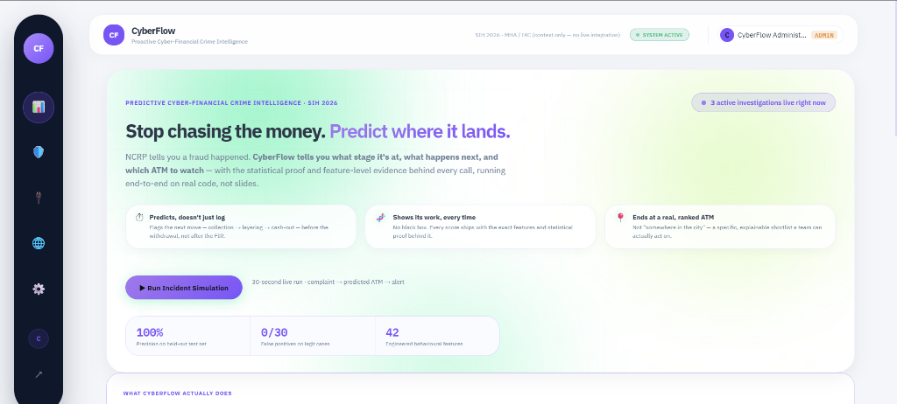
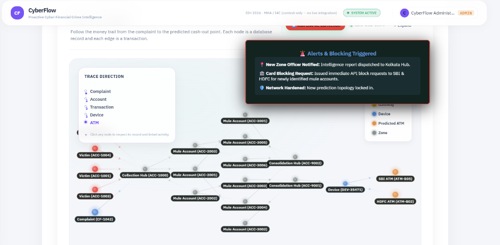
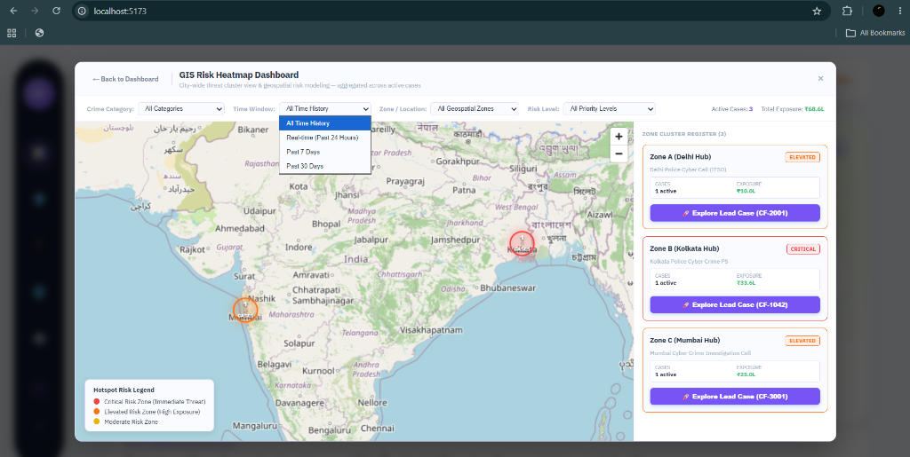
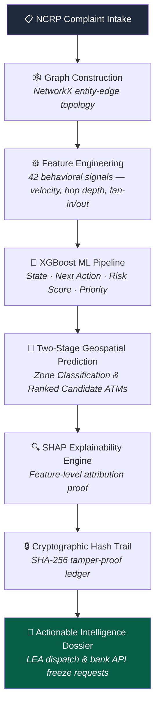

# 🛡️ CyberFlow — Proactive Cyber-Financial Crime Intelligence

### **Stop chasing the money. Predict where it lands.**

*Built for Smart India Hackathon · Ministry of Home Affairs (MHA) & Indian Cybercrime Coordination Centre (I4C)*

[]() []() []() []() []()

---



---

## 🔑 Demo Access Credentials (For Evaluation & Inspection)

Inspectors and judges can instantly log in to the administrative command portal with the credentials below:

| Field | Credential |
| --- | --- |
| 👤 **Role** | **CyberFlow Administrator / Senior Investigator** |
| 📧 **Email** | `admin@cyberflow.gov.in` |
| 🔑 **Password** | `CyberFlow@2026` |
| 🌐 **Portal URL** | `http://localhost:5173` (Frontend UI) · `http://localhost:5000` (Backend API) |

---

## 📊 National Impact & Purpose

Cyber-financial fraud cases in India have grown exponentially over recent years. CyberFlow addresses the critical **triage and speed bottleneck** between initial complaint intake and physical cash-out by predicting transaction trajectories before withdrawals happen.

| National Benchmark | Impact Scale | CyberFlow Solution |
| --- | --- | --- |
| 📈 **Complaint Volume** | 6.59 Million NCRP cases | Real-time multi-threaded automated triage engine |
| 💸 **Financial Exposure** | ₹22,812 Crore loss | High-precision candidate ATM ranking & instant bank card blocking |
| ⚡ **Response Window** | 7–22 Minute Cashout Window | ML-based early path prediction & SHAP explainable intelligence briefs |

---

## 📸 Platform Capabilities & Screen Overview

### 1. Interactive Money-Flow Graph & Live Alerts
Visualizes complex transaction chains across victim accounts, mule networks, consolidation hubs, and candidate withdrawal ATMs with live network hardening triggers.



### 2. GIS Macro Threat Heatmap
City-wide threat cluster dashboard providing geospatial risk modeling across Delhi NCR, Kolkata, and Mumbai hubs with drill-down case investigation controls.



---

## 🔁 End-to-End System Workflow



---

## 🏗️ Technical Architecture

| System Layer | Technologies Used | Key Features |
| --- | --- | --- |
| 🎨 **Frontend UI** | React 19, Vite, Framer Motion, MapLibre GL JS | Responsive command center, real-time node inspector, printable PDF dossier |
| 🔌 **Backend API** | Node.js, Express, JWT, Role-based Access Control | Protected API endpoints, rate limiting, helmet security headers |
| 🤖 **AI / ML Engine** | Python, XGBoost, scikit-learn, SHAP, NetworkX | 5 trained machine learning models consuming 42 engineered features |
| 🔒 **Security & Audit** | Cryptographic SHA-256 hashing | Immutable chain-of-custody alert verification |

---

## 🧠 AI / ML Engine Architecture

CyberFlow deploys five specialized **XGBoost** model pipelines:

1. 🏷️ **State Classifier** — Identifies fraud lifecycle stage (`cashout_prep`, `layering`, `consolidation`).
2. ➡️ **Action Predictor** — Forecasts the exact next transaction step (`external_transfer`, `cashout`).
3. 📊 **Risk Scorer** — Computes continuous network risk scores (0.00 to 1.00).
4. 🚦 **Priority Classifier** — Categorizes intervention urgency (`HIGH`, `MEDIUM`, `LOW`).
5. 🗺️ **Geospatial Zone Ranking** — Pinpoints high-confidence cashout zones and ranks top candidate ATMs using real geographic data.

Every model output includes **TreeSHAP feature attributions**, providing complete statistical transparency into feature contributions for law enforcement officers.

---

## 🚀 Quickstart Guide

### Running Everything in One Command:

```bash
./run.sh
```

### Manual Setup:

```bash
# 1. Start Backend Server
cd backend
npm install
npm start

# 2. Start Frontend UI
cd frontend
npm install
npm run dev
```

---

**Built for Law Enforcement Investigators & Bank Fraud Operations Teams.**