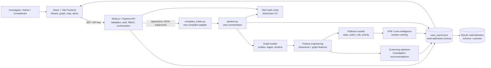
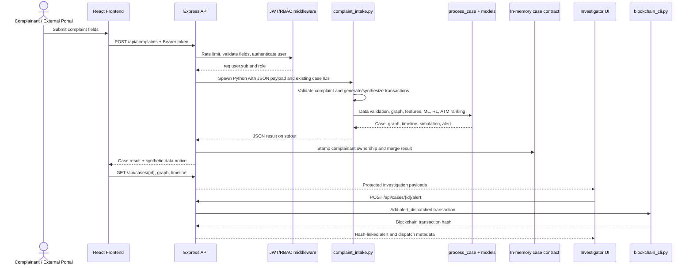

# CyberFlow: Technical Architecture & System Write-up

## 1. System Architecture
CyberFlow is a full-stack proactive cyber-financial crime intelligence platform. The architecture comprises:
- **Frontend**: A React-based web application (Vite) designed for law enforcement and nodal agencies, offering a wizard-style investigation interface with interactive network graphs.
- **Backend (Node.js/Express)**: A secure API layer handling authentication, role-based access control, data serving, and orchestrating Python subprocesses for AI inference.
- **AI Engine (Python)**: A modular ML pipeline trained on synthetic transaction data, utilizing both XGBoost classifiers and a Reinforcement Learning (Q-learning) optimizer for graph traversal recommendations.

### 1.1 Logical Component Architecture

The system is organized into four runtime boundaries and one build-time data boundary:



The normal dashboard is read-oriented: the backend loads `case_export.json` at startup and exposes slices of that object through protected endpoints. A newly submitted complaint is the exception: it executes the Python intake pipeline synchronously, then appends the returned case, graph, timeline, simulation, and validation objects to the in-memory dataset so it immediately uses the same dashboard APIs as the precomputed demo cases.

### 1.2 End-to-End Request Workflow

The following is the complete workflow for a new complaint and subsequent investigator action:



### 1.3 Runtime Modes

CyberFlow has two supported execution modes:

1. **Demo/mock mode**: The frontend reads `frontend/src/data/caseExport.json`. This mode is useful for a zero-backend presentation and still exercises the React investigation workflow.
2. **Live mode**: Set `VITE_USE_MOCK=false`. The frontend calls the Express API, which reads the generated export and can execute the Python complaint intake and blockchain CLI subprocesses.

The root `npm run dev` command starts the backend and frontend concurrently. Python dependencies are installed from `ai-engine/requirements.txt`; Node dependencies are installed separately for `backend` and `frontend`.

## 2. Detailed Data and Processing Workflow

### 2.1 Input and API Boundary

The complaint boundary accepts an NCRP-style payload containing `complainant_name`, `complainant_phone`, `fraud_type`, `description`, and `amount_inr`. Express performs the first validation pass with `express-validator`, limits complaint submissions to 10 requests per 15 minutes, and injects the authenticated subject as `_complainant_id`. The Python layer repeats domain validation, including required fields, supported scenarios, and positive numeric amount validation. This two-layer validation prevents malformed API requests from entering model processing and ensures direct Python invocation has the same basic guardrails.

External systems can use `POST /api/integration/predict` with `x-api-key`. A request may either retrieve an existing case by `case_id` or submit a new `complaint`. The response is intentionally a compact prediction contract: current state, network risk, intervention priority, next action probabilities, probable zones, ranked ATM candidates, evidence status, and explanation.

### 2.2 Complaint-to-Case Transformation

The prototype does not claim access to a live bank or NPCI transaction stream. For a fresh complaint, `complaint_intake.py` generates a transaction network consistent with the reported fraud type and rescales transaction values to the reported loss amount. Device fingerprints are then assigned. This makes the complete workflow reproducible while preserving an explicit synthetic-data notice in the response.

The generated case is passed to the same `process_case()` function used by the three demo cases. There is no separate inference implementation for newly filed complaints. For legitimate-business and thin-evidence demonstrations, controlled scenarios exercise the false-positive and insufficient-evidence safeguards.

### 2.3 AI Processing Stages

Each case follows these stages:

1. **Data validation**: Checks transaction sufficiency and structural validity, then records a validation report. Cases with insufficient evidence are represented as such rather than being treated as confident fraud predictions.
2. **Relationship analysis**: `CaseGraphBuilder` converts account-to-account transfers into nodes and directed edges. Topology supplies roles and relationships such as victim source, mule, consolidation hub, and terminal/cashout entities.
3. **Feature engineering**: Graph features include fan-in, fan-out, hop depth, and betweenness. Behavioral features include device consistency and transaction velocity. The resulting feature vector follows the model metadata feature-column order.
4. **Statistical validation**: Feature correlation/significance analysis and legitimate-business evaluation are run over the training dataset. Their reports are stored in the export and exposed through `/api/feature-analysis` and `/api/evaluation`.
5. **ML inference**: The classifier loads the trained XGBoost artifacts for current state, next action, risk score, and intervention priority. If model loading is unavailable, the engine records a rule-based fallback mode rather than silently presenting ML provenance.
6. **Explanation generation**: The classifier emits the contributing reasons and probability distribution used by the investigator-facing explanation panel.
7. **Path prediction and RL recommendations**: The path predictor estimates multi-stage outcomes, while the tabular Q-learning optimizer recommends sequential investigation actions. These are separate signals: path prediction estimates what may happen next; RL recommends where to investigate next.
8. **Zone and ATM intelligence**: Candidate locations are ranked by probable zone, then ATM candidates are ranked using location, account, withdrawal, and behavioral evidence. The output is a shortlist, not an exact-location claim.
9. **Simulation**: Zone-specific simulations estimate preventable impact, remaining exposure, and network impact for intervention planning.
10. **Alert construction**: The case is converted into an alert-ready record containing priority, predicted action, probability, time window, location, ATM, exposure, recipients, and explanation.

### 2.4 Export Contract and Persistence Model

`pipeline.py` assembles a single export with these top-level collections:

```text
cases             case-level predictions, evidence, explanations, risk and priority
graphs            per-case nodes and directed transaction edges
timelines         per-case staged graph progression
simulations       per-case zone intervention outcomes
alerts            hash-linked alert records
data_validation   per-case validation and sufficiency reports
model_proof       model fingerprints, feature columns, metrics and inference mode
feature_analysis  correlation and significance results
evaluation_report confusion matrix and legitimate-business evaluation
```

The backend currently treats this export as a read-optimized serving contract and keeps newly created records in memory for the running process. Separately, `ai-engine/db/build_db.py` materializes the same data into SQLite using `ai-engine/db/schema.sql`. The relational design models `Complainant -> Complaint -> Account -> Transaction`, device/location evidence, ATM history, predictions, prediction features, and alerts. The current backend exposes the schema and query preview; it does not open a live SQLite connection for request handling. A production implementation should replace the in-memory merge with transactional persistence and make the database the system of record.

## 3. Frontend and API Interaction Architecture

The React application is organized as a stateful investigation shell. `AuthContext` owns session state and the JWT stored in local storage. `src/api/index.js` is the transport boundary and switches between mock JSON and live HTTP using `VITE_USE_MOCK`. `App.jsx` owns the selected case, wizard step, timeline state, graph-node freeze state, simulation state, and overlay visibility.

The investigator workflow is presented as five steps:

1. **Incident**: intake summary, fraud type, loss, validation status, and evidence.
2. **Correlate**: graph nodes, directed money flow, timeline stages, and database evidence.
3. **Predict**: current state, next action, risk, explanation, path prediction, and RL recommendations.
4. **Map**: probable zones, ATM shortlist, and intervention simulation.
5. **Action**: alert generation, recipients, evidence summary, hash chain, and dispatch state.

Representative protected API calls are `GET /api/overview`, `GET /api/cases`, `GET /api/cases/:case_id`, `GET /api/cases/:case_id/graph`, `GET /api/cases/:case_id/timeline`, `POST /api/cases/:case_id/simulate`, and `POST /api/cases/:case_id/alert`. The frontend does not calculate model results; it renders backend/contract outputs and manages presentation state.

## 4. Security, Reliability, and Operational Boundaries

### 4.1 Security Model
We implemented a robust security model to protect sensitive financial data:
- **Role-Based Access Control (RBAC)**: Enforced at the endpoint level via a custom `requireRole` middleware. Admin/investigator endpoints are strictly walled off from complainants.
- **Data Segregation by Ownership**: Complainants can only view cases matching their `complainant_id`. This was verified using a local script (`test_access_control.sh`/`ps1`) demonstrating `403 Forbidden` responses when complainants attempt to access admin endpoints or other users' cases.
- **Token Security**: Authentication relies on JWT (JSON Web Tokens) with payload hashing.
- **API Hardening**: We employ Helmet for HTTP header security and Express rate limiters to mitigate DoS and brute-force attacks.

### 4.2 Prediction Algorithms
CyberFlow uses a hybrid AI approach for predictive intelligence:

#### 4.2.1 Machine Learning (XGBoost)
- **State & Action Prediction**: We extract graph-theoretic features (fan-in, fan-out, betweenness, hop-depth) and behavioral features (device consistency, transaction velocity). XGBoost models predict the current operational state of the fraud network (e.g., 'consolidation', 'layering') and the most likely next action (e.g., 'cashout', 'further_layering').
- **Verification Evidence**: The models achieved ~93.5% accuracy on holdout test sets, with a 0% False Positive Rate on legitimate-business scenarios.

#### 4.2.2 Reinforcement Learning (Tabular Q-Learning)
- **Sequential Exploration**: While XGBoost provides a point-in-time prediction, the RL optimizer learns the best sequential steps to investigate a network (e.g., whether to investigate a hub vs. a terminal node). 
- **Training & State Space**: The RL agent is trained on discretized state tuples derived from the network features. We implemented a nearest-neighbor state matching fallback to handle unseen state configurations during inference.
- **Verification Evidence**: Running `pipeline.py` populates the `case_export.json` with ranked Q-values for actions like `follow_money_trail` and `investigate_terminal`, with distinct, non-zero values demonstrating active learning.

*Note: The RL recommendation (sequential graph exploration) and the XGBoost Path Predictor (multi-stage outcome prediction) are independent signals operating on different timescales.*

### 4.3 Business Model & Integration
CyberFlow does not force existing government portals to be replaced. Instead, it acts as an **intelligence layer** via API.
- **B2G Integration**: Platforms like the National Cyber Crime Reporting Portal (NCRP) or bank fraud-detection systems can send structured complaint data to CyberFlow's `/api/integration/predict` endpoint.
- **Monetization (API Billing)**: The system charges a per-request fee (e.g., ₹10 per API call) authenticated via `x-api-key`. 
- **Demo Verification**: We built a dedicated `/ncrp-demo` portal styled identically to standard government portals. Submitting a complaint through it bypasses the CyberFlow UI, hits the backend API directly, and renders the JSON intelligence report inline, proving the headless capability of the AI engine.

## 5. Honest Assessment: Implemented vs. Future Work

**Fully Implemented & Working:**
- Secure authentication and RBAC with complainant isolation.
- Interactive Force-directed graph visualizations (fullscreen capable).
- End-to-end Python ML pipeline with synthetic data generation, XGBoost training, and feature extraction.
- RL Q-learning tabular implementation for investigation steps.
- Headless API integration (NCRP demo) with basic billing dashboard metrics.

**Limitations & Future Work:**
- **Real-Time Data Streams**: Currently, the system relies on static synthetic JSON/CSV files. Integrating with Kafka or a real streaming database (like TimescaleDB) is required for production.
- **RL Scalability**: Tabular Q-learning is sufficient for the simplified state space used in this prototype. For a production environment with millions of edge variables, a Deep Q-Network (DQN) using PyTorch/TensorFlow would be required.
- **Blockchain Verification**: While the PoW blockchain is implemented locally, it needs to be transitioned to a permissioned ledger (like Hyperledger Fabric) for cross-agency trust.
